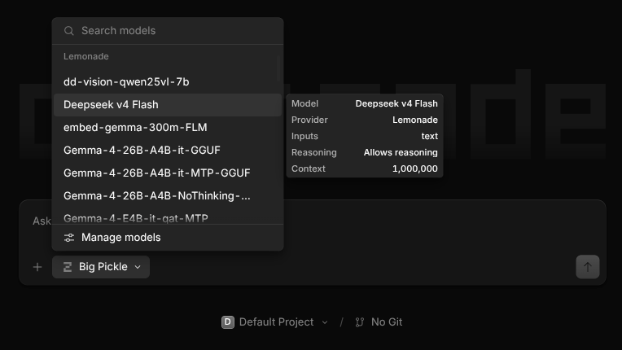

# opencode-lemonade

[](https://deepwiki.com/abn/opencode-lemonade)
[](https://npmjs.org/package/opencode-lemonade)

Dynamic model discovery and zero-config provider initialization for [Lemonade](https://github.com/lemonade-sdk/lemonade) in [OpenCode](https://opencode.ai).

This is a v2 OpenCode plugin (`@opencode/plugin` 2.x). It registers Lemonade through the v2 `setup(ctx)` lifecycle and `ctx.provider.transform`, and does not run on OpenCode 1.x.

On OpenCode 1.x, pin the last v1 release, `opencode-lemonade@0.3.0`:

```jsonc
{
  "plugin": ["opencode-lemonade@0.3.0"],
}
```

That line uses the v1 `plugin` config key and the v1 plugin implementation. Version 1.0.0 and later target OpenCode 2.x only. See the [v1 to v2 migration guide](docs/usage/migration-v2.md) for the config and override changes.

## Overview

This plugin connects OpenCode to a Lemonade server, discovering all available or downloaded models at startup and registering them through the v2 plugin provider transform. It removes the need to manually enumerate models, context sizes, output token limits, and vision modalities in your `opencode.json` / `opencode.jsonc`.



### Key features

- **Zero-config auto-registration**: automatically configures the `lemonade` provider with `@opencode/ai/providers/openai-compatible` if not already defined.
- **Dynamic model discovery**: queries the Lemonade server (`/v1/models`) and registers all matching models under the `lemonade` provider.
- **Hardware and context awareness**: reads context length (`ctx_size` / `context_length`) and output token limits from Lemonade model specs.
- **Multimodal / vision detection**: detects vision models (e.g. Qwen 2.5 VL) from labels (`vision`, `vlm`) or ids, setting the model input modalities to text and image.
- **Capability mapping**: maps the Lemonade `tool-calling` label to the v2 model tools capability, and the `reasoning` label to `compatibility.reasoningField` so reasoning models are recognized and their reasoning content is parsed.
- **Downloaded-only filtering**: distinguishes local on-disk weights from cloud backends, so only ready-to-run local models are exposed by default.
- **Flexible pattern filtering**: filter models with glob wildcards (`*`, `?`), regular expressions (`/.../flags`), or label tags.
- **Layered API resolution**: respects explicit options, `{env:...}` / `{file:...}` templates, existing provider settings, and Lemonade environment variables (`LEMONADE_HOST`, `LEMONADE_API_KEY`, `LEMONADE_ADMIN_API_KEY`).

## Why a dedicated plugin

OpenCode only auto-polls a small hardcoded set of providers (such as Ollama, LM Studio, and vLLM). Custom OpenAI-compatible endpoints are treated as static providers:

1. **No polling for custom endpoints**: every model, quant, or newly downloaded checkpoint must be hardcoded in `opencode.jsonc`.
2. **Metadata blindness in the standard catalog**: the plain `/v1/models` response does not carry context window limits, vision capabilities, or download status. Generic discovery would cap prompt capacity, disable image input, and dump hundreds of undownloaded models into the picker.
3. **Canonical extension lifecycle**: like `opencode-litellm` and similar plugins, this plugin registers a provider transform during load to hydrate OpenCode from Lemonade's rich catalog.

See [the design rationale](docs/design/rationale.md) for more detail.

## Installation

Requires OpenCode 2.x.

### From npm

Add the plugin to your OpenCode config and let the CLI resolve it:

```bash
opencode plugin add opencode-lemonade
```

Or declare it explicitly:

```jsonc
{
  "$schema": "https://opencode.ai/config.json",
  "plugins": ["opencode-lemonade"],
}
```

### From GitHub Releases

```bash
mkdir -p ~/.config/opencode/plugins
curl -L -o ~/.config/opencode/plugins/lemonade-discovery.js \
  https://github.com/abn/opencode-lemonade/releases/latest/download/lemonade-discovery.js
```

The release artifact imports `@opencode/plugin` at runtime, so the npm install
above is the supported path. Prefer it.

### Local build

```bash
npm run build
mkdir -p .opencode/plugins
cp dist/lemonade-discovery.js .opencode/plugins/
```

OpenCode loads `.js` and `.ts` files from `.opencode/plugins/` in a project and
from `~/.config/opencode/plugins/` globally.

## Configuration

The plugin works with zero configuration using default environment variables. Options are passed as plugin options; custom hosts, API keys, and headers are plugin options too, so no provider block is needed for those. To pass options, use the v2 object entry:

```jsonc
{
  "$schema": "https://opencode.ai/config.json",
  "plugins": [
    {
      "package": "opencode-lemonade",
      "options": {
        "host": "{env:LEMONADE_HOST}",
        "apiKey": "{env:LEMONADE_API_KEY}",
        "downloaded_only": true,
        "cloud_models": "include",
        "exclude": ["insecure.*", "*embedding*", "*whisper*", "*:batch"],
        "exclude_labels": ["embedding", "tts", "stt"],
        "default_output_limit": 8192,
        "max_context_limit": 128000,
        "timeout_ms": 10000,
      },
    },
  ],
}
```

`host` and `apiKey` fall back to the `LEMONADE_HOST` and `LEMONADE_API_KEY`
environment variables when omitted. Only pre-define the provider when you need
settings the plugin does not manage, such as a different provider package; the plugin keeps an existing provider and only adds the discovered models.

### Fetch timeout

Discovery runs once at load and aborts after `timeout_ms`, which defaults to
`3000`. A cold Lemonade server can take close to that to answer the first
catalog request; when it does, discovery gives up and the provider is registered
with no models until the next load. Set `timeout_ms` higher (for example
`10000`) on slower hosts or when the server runs on modest hardware. The plugin
still never blocks startup past the timeout.

### Environment variables

Resolution precedence for host and API key:

1. Explicit option or existing provider settings (`settings.baseURL`, `settings.apiKey`).
2. Template expansion (`{env:VARIABLE_NAME}` or `{file:/path/to/secret}`).
3. Environment variables: `LEMONADE_HOST`, then `LEMONADE_API_KEY`, then `LEMONADE_ADMIN_API_KEY`.

## Options

See the [options reference](docs/reference/options.md) for every option, its type, default, and filtering behavior.

## Development

```bash
make setup      # install dependencies
make check      # full quality gate: okf, lint, test, build
make test       # run the test suite
```

## License

MIT. See [LICENSE](LICENSE).
